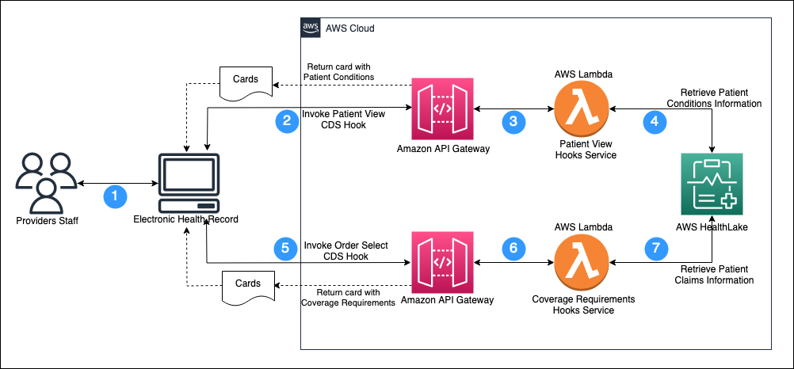
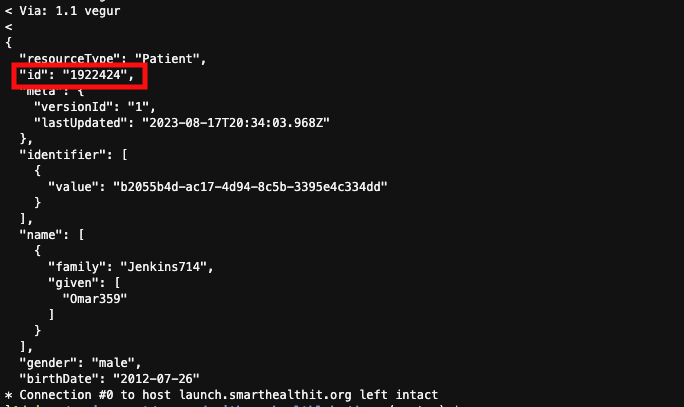
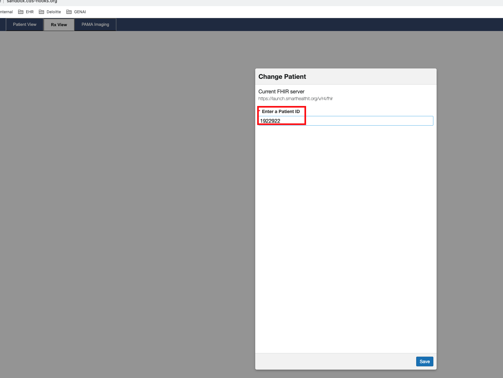
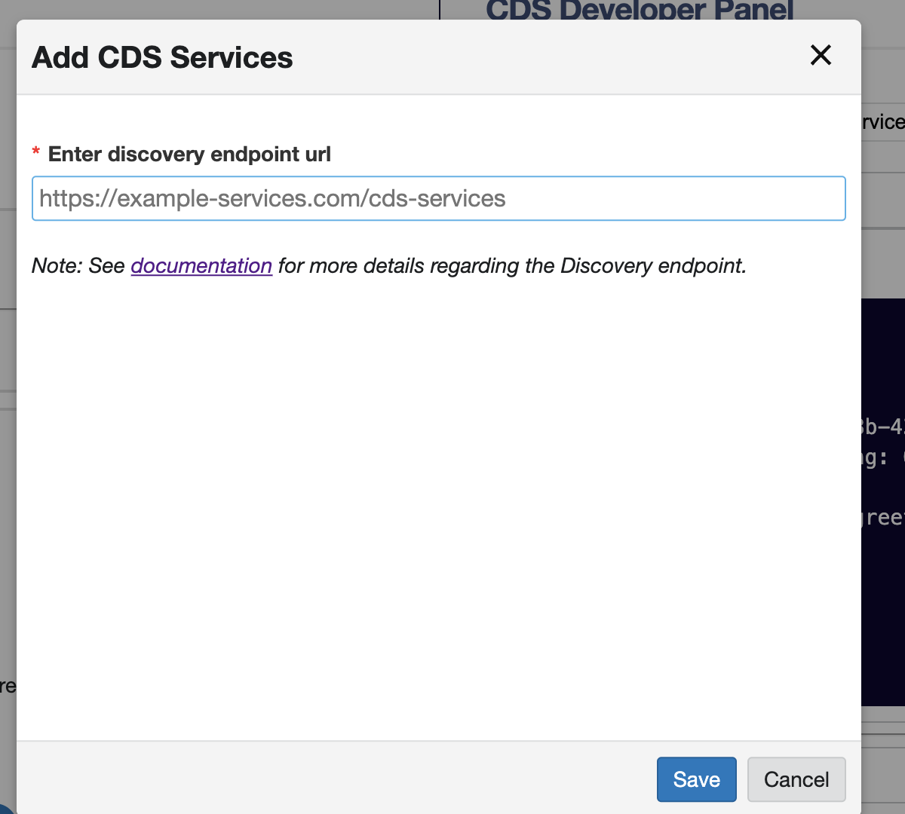
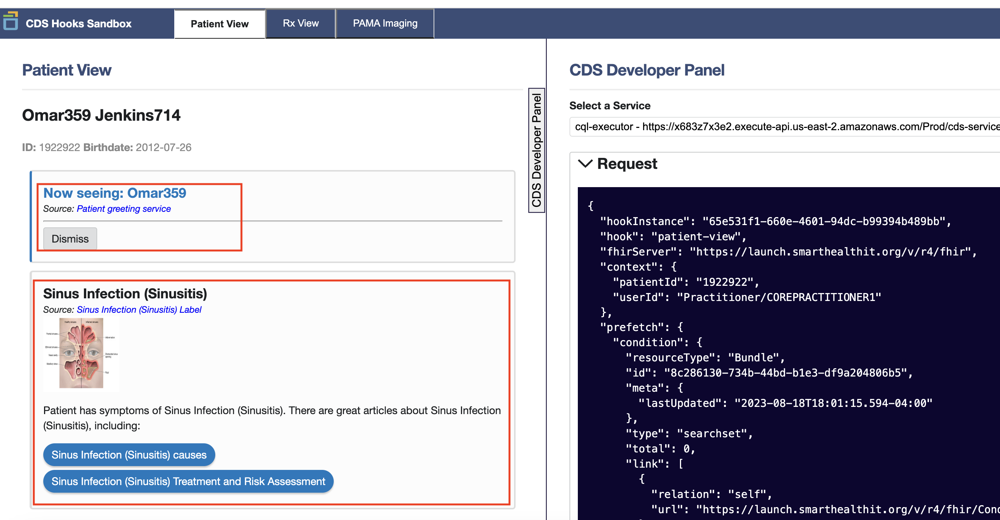
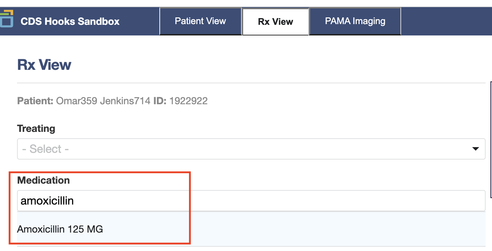
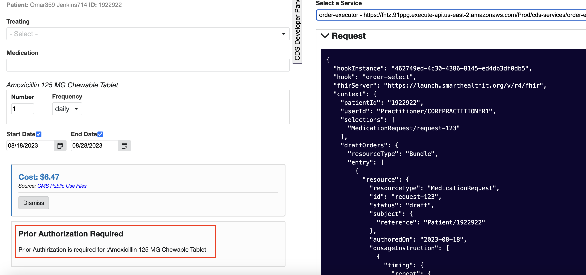

# Coverage Requirements Discovery (CRD) with AWS HealthLake

CRD is a serverless workflow that accelerates clinical decision processes using CDS Hooks and AWS HealthLake.  This workflow uses two hooks (`patient-view` and `order-view`) and a [Clinical Quality Language](https://cql.hl7.org/) (CQL) rule for prior authorization to detemine if prior authorization is required.

## Design



The workflow steps:

1. The provider's staff logs into EHR to open a Patient Chart.
2. The EHR system validates the user's credentials and invokes the Patient View CDS Hook to retrieve patient conditions information.
3. Amazon API Gateway invokes the Patient View Hooks AWS Lambda function.
4. The Patient View Hooks AWS Lambda function validates and retrieves the Patient ID from the request and gets the Patient Conditions Information from HealthLake.
5. After reviewing Patient Conditions, the user invokes the Order Select CDS Hook to retrieve coverage requirements information for the respective drug.
6. Amazon API Gateway invokes the Coverage requirements Hooks AWS Lambda function.
7. The Coverage requirements Hooks AWS Lambda function retrieves claims information for the patient, executes CQL rules based on the medication submitted and claims information retrieved from HealthLake, and makes a determination whether prior authorization is required.


## Installation
### Prerequisites
1. [AWS SAM](https://docs.aws.amazon.com/serverless-application-model/latest/developerguide/serverless-sam-cli-install.html)
2. yarn
3. Python 3.8

### Deploying the solution

1. Clone the repository and navigate to the solution directory:

```sh
git clone git@ssh.gitlab.aws.dev:manishpl/crd-hooks-with-awshealthlake.git
cd aws-crd-with-awshealthlake/
```

2. Build the application using following command:

```sh
sam build
```

3. Deploy the application using the guided process below:

***WARNING:*** The steps below ask "___ has no authentication. Is this okay?"  This warning calls out that the API Gateway stage being deployed has no authentication or authorization.  That means this endpoint may be called by any actor anywhere in the world that discovers this DNS name or public IP address.  This sample code only gives access to fake data in the AWS HealthLake database it deploys, so there is no danger in exposing real data or exposing an API that can change or remove resources from your AWS account.  A secure system will have authorization or other checks such as using [IAM idenity policies and SIGv4](https://docs.aws.amazon.com/apigateway/latest/developerguide/security_iam_service-with-iam.html), [API Keys](https://docs.aws.amazon.com/apigateway/latest/developerguide/api-gateway-setup-api-key-with-console.html), or an [AWS API Gateway Lambda Authorizer](https://docs.aws.amazon.com/apigateway/latest/developerguide/apigateway-use-lambda-authorizer.html).

Consider deleting this CloudFormation stack as soon as you are done evaluating this demo.

```sh
sam deploy --guided
# Replace MY_VALUE and MY_ACCOUNT_ID with proper resource names
Configuring SAM deploy
======================

Looking for config file [samconfig.toml] :  Not found

	Setting default arguments for 'sam deploy'
	=========================================
	Stack Name [sam-app]: aws-cds-hooks-with-healthlake
	AWS Region [us-east-1]: us-east-2
	#Shows you resources changes to be deployed and require a 'Y' to initiate deploy
	Confirm changes before deploy [y/N]:
	#SAM needs permission to be able to create roles to connect to the resources in your template
	Allow SAM CLI IAM role creation [Y/n]:
	#Preserves the state of previously provisioned resources when an operation fails
	Disable rollback [y/N]:
	cdsDemoServicesFunction has no authentication. Is this okay? [y/N]: y
	cqlQueryFunction has no authentication. Is this okay? [y/N]: y
	cqlQueryOrderFunction has no authentication. Is this okay? [y/N]: y
	Save arguments to configuration file [Y/n]: y
	SAM configuration file [samconfig.toml]:
	SAM configuration environment [default]:
```

The deployment may take 30 minutes or more while AWS creates an AWS HealthLake datastore and related resources in your AWS account. AWS SAM may timeout and return you to your command line. This timeout stops SAM from showing you the progress in the cloud, but does not stop the deployment happening in the cloud. If you see a timeout, go to the [us-east-2 AWS CloudFormation console page](https://us-east-2.console.aws.amazon.com/cloudformation/home?region=us-east-2#/stacks) and verify deployment status in the AWS CloudFormation stack deployment status.

## Post Deployment Steps

### Create patient resource in SmartHealthIT FHIR ServerHeader

The CDS Hooks Sandbox (coined here as "Sandbox") is a tool that allows users to simulate the workflow of the CDS Hooks standard. It acts as a sort of "mock"-EHR (Electronic Health Record) that can be used as a demonstration tool for showing how CDS Hooks would work with an EHR system, as well as a testing tool to try out different CDS Services to ensure compatibility with the specifications. The CDS Hooks sandbox needs a publicly exposed FHIR server configured along with a patient ID. AWS HealthLake requires a SigV4 token to access FHIR resources hence we cannot configure CDS Hooks sandbox to use AWS HealthLake. Due to this we will need to use the open SmartHealthIT FHIR server and this server can be configured with the CDS Hooks Sandbox. AWS HealthLake with the SMART feature can be used as a FHIR server if EHR is available instead of the CDS Hooks Sandbox. For this post, we will use SMARTHealthIT FHIR server configured with CDS Hooks sandbox. The AWS HealthLake patient that you have created above is pre-populated with [Synthea](https://synthea.mitre.org/) data. The `healthlakepatient.json` file was created from one of these synthetic records. This file is used to create a patient on the publicly exposed SmartHealthIT FHIR server as mentioned below.

Navigate to docs directory where the `healthlakepatient.json` file is located. Run the command below to create the patient on the SmartHealthIT FHIR server:

```sh
curl -v \
   -X POST --data @healthlakepatient.json \
   -H 'Content-Type: application/json+fhir' \
   https://launch.smarthealthit.org/v/r4/fhir/Patient
```

The output of the curl command will show a response JSON message that will include the patient ID on the SmartHelathIT server. Please make a note of it and save it in a temporary file if needed. If you see any errors, make sure that the `healthlakepatient.json` file is valid, including the snippet under the resource tag.



 ### Configure CDS Hooks sandbox

Go to http://sandbox.cds-hooks.org  on a new browser tab.

Click on the down arrow on top right next to the gear icon. Select Change FHIR server option. Enter the url value as https://launch.smarthealthit.org/v/r4/fhir  on the text box.

Next, there will be a prompt to enter the patient ID. Please paste the patient ID saved in the previous step.



Next we will get the API endpoint for our CDS service. Run the below command in a Cloud9 terminal to get the CDS service API endpoint.

```sh
aws cloudformation describe-stacks \
   --stack-name aws-crd-with-amazonhealthlake \
   --query 'Stacks[].Outputs[?OutputKey==`CDSDemoServicesApi`].OutputValue' \
   --output text
```

Make a note of the output. We will be using it in the next step.

We will now configure the settings on the CDS Hooks Sandbox. Click on the top right arrow and you will see a menu box. Choose the option to add CDS service. Paste the API endpoint that we retrieved in the previous step.



You will see some APIs are now populated. You will notice that the patient-view hook is now executed for the configured patient that was created in Amazon Healthlake. The cards returned from the API indicate that the patient has a Sinus Infection health condition and the doctor may need to order a prescription.



Navigate to the RX View tab to order a prescription.  Acting as the doctor, enter the medication name in the medication box, select medication, and enter other details as shown below:



You will notice that the order-select hook is returned with a Prior Authorization eligibility card.



Next step would be to submit a Prior Authorization using a SMART App or other mechanism available to the provider.
